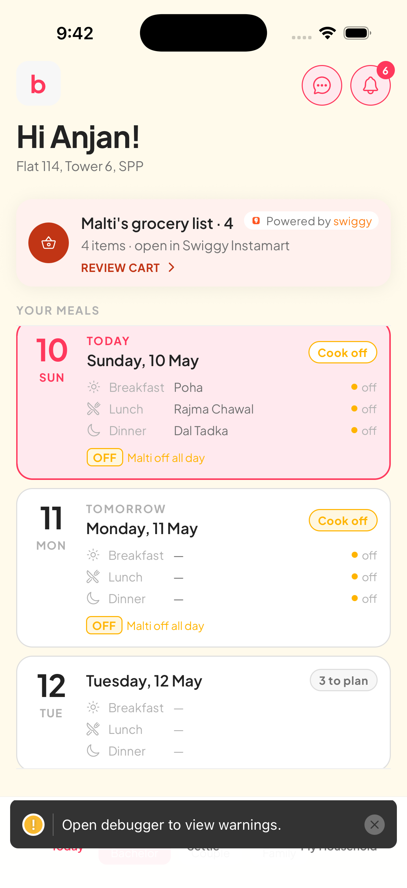
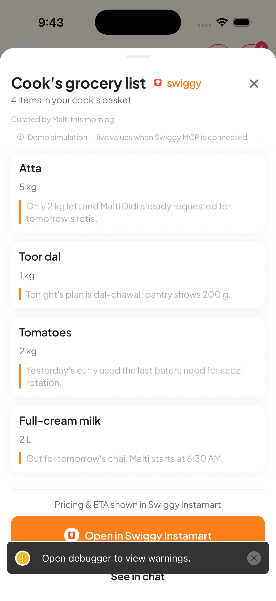
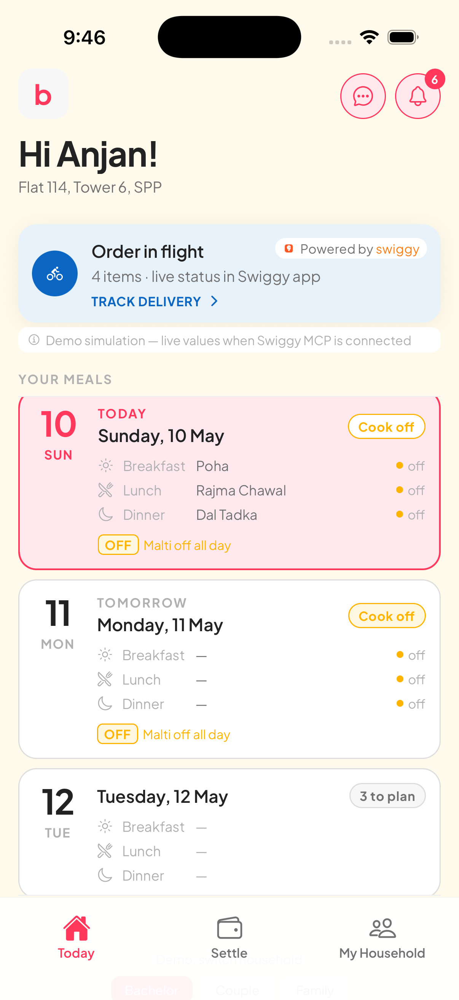
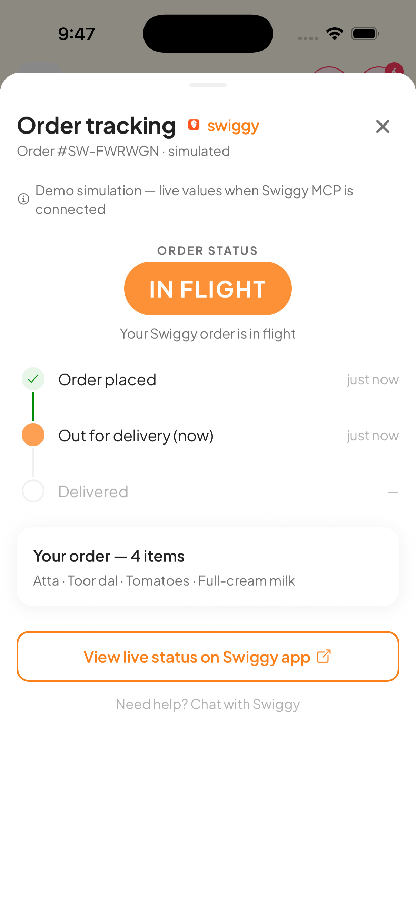
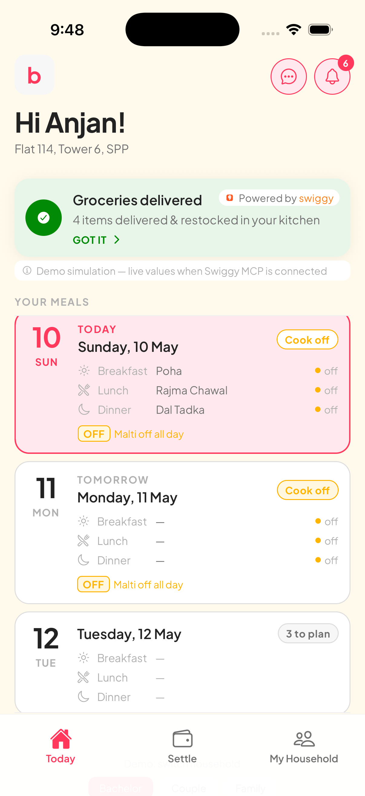
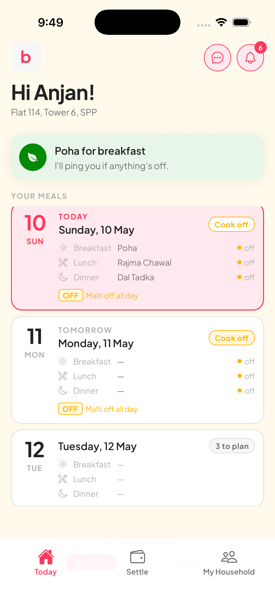

# Bimi × Swiggy MCP

Bimi is the household-side coordinator for Indian families with daily cooks. The cook lives on WhatsApp; the household lives in Bimi. **Swiggy MCP is the rail we don't have yet — the one piece that closes the cook → cart → kitchen loop without the household ever leaving Bimi.**

Public-safe snapshot of the Bimi product for the [Swiggy MCP Builders Club](https://mcp.swiggy.com/builders/access/) review.

---

## The integration in 6 screens

| | |
|---|---|
|  | **1. Cook flags items via WhatsApp.** Bimi parses Hinglish messages into structured grocery items with reasoning attached. The household sees one card on home, not four notifications. |
|  | **2. One-tap review.** Each row: item, quantity, *the cook's reasoning* — what makes the household trust the cart enough to send it without re-litigating. No invented prices or ETAs (Builders rules). |
|  | **3. Place via Swiggy.** Today this simulates the handoff. With MCP, the tap *is* the order — Instamart MCP tools are called, the order is placed against the household's saved Swiggy account, no app switch. |
|  | **4. Native tracking.** Status pill says `IN FLIGHT` — never an invented minute count. With MCP webhooks, that pill becomes a live ETA and the timeline fills in from real driver milestones, all rendered in Bimi. |
|  | **5. Auto-restock on delivered.** Bimi auto-restocks the household's inventory in the same step Swiggy marks delivered. No "confirm what arrived" modal. Trust contract. |
|  | **6. Out of the way.** Whole loop: one tap, ~90 seconds. |

---

## Compliance posture

Built explicitly against the [Builders ground rules](https://mcp.swiggy.com/builders/access/) — *misrepresenting prices/availability/delivery times* and *misattributing data sources* are zero-tolerance items, so:

- Every Swiggy-attributed surface carries a persistent **`<DemoSimulationBanner>`** ([source](app/components/patterns/DemoSimulationBanner.tsx))
- **No invented values rendered:** no ₹, no ETA minute count, no driver name, no brand attribution
- **Status language replaces specific countdowns** — `IN FLIGHT` not `1 MIN`; timeline reads `just now` / `—` not fabricated clocks
- Reserved data fields ([`ActionItem`](app/lib/types.ts)) annotated for MCP wire-up; rendered nowhere today

---

## Code paths reviewers should look at

| Surface | File |
|---|---|
| Cook hero on home | [`app/components/NextBestActionHeroes.tsx`](app/components/NextBestActionHeroes.tsx) — `UnreadCookMessageHero` |
| Cart sheet | [`app/components/patterns/CookActionsSheet.tsx`](app/components/patterns/CookActionsSheet.tsx) |
| In-flight + delivered heroes | [`app/components/patterns/SwiggyDeliveryHeroes.tsx`](app/components/patterns/SwiggyDeliveryHeroes.tsx) |
| Native tracking sheet | [`app/components/patterns/SwiggyTrackingSheet.tsx`](app/components/patterns/SwiggyTrackingSheet.tsx) |
| Lifecycle state machine | [`app/lib/swiggy-delivery-store.ts`](app/lib/swiggy-delivery-store.ts) |
| Compliance banner | [`app/components/patterns/DemoSimulationBanner.tsx`](app/components/patterns/DemoSimulationBanner.tsx) |
| Cook-message intent parser (backend) | [`backend/app/services/whatsapp_intents.py`](backend/app/services/whatsapp_intents.py) |
| MCP ordering scaffold (backend) | [`backend/app/services/mcp_ordering.py`](backend/app/services/mcp_ordering.py) |
| WhatsApp ingress PoC | [`whatsapp-poc/server.py`](whatsapp-poc/server.py) |

---

## What MCP unlocks

Each row below is a one-line render swap on data Bimi already shapes today — no schema changes:

| Today | With MCP |
|---|---|
| Cart CTA simulates handoff | Cart CTA places the order via Instamart MCP, in-app |
| Status pill: `IN FLIGHT` | Status pill: live ETA from order-status events |
| Auto-restock on demo timer | Auto-restock on delivered webhook |
| ₹ / ETA / brand omitted | Real values from MCP price + availability lookup |

**What Bimi unlocks for Swiggy:** recurring cook-driven grocery orders from a segment of Indian households that doesn't otherwise open Instamart three times a week. The cook is the trigger Bimi already has. We just need the rails.

---

## Contact

[dasanjan1296@gmail.com](mailto:dasanjan1296@gmail.com)

[MIT licensed](LICENSE).
